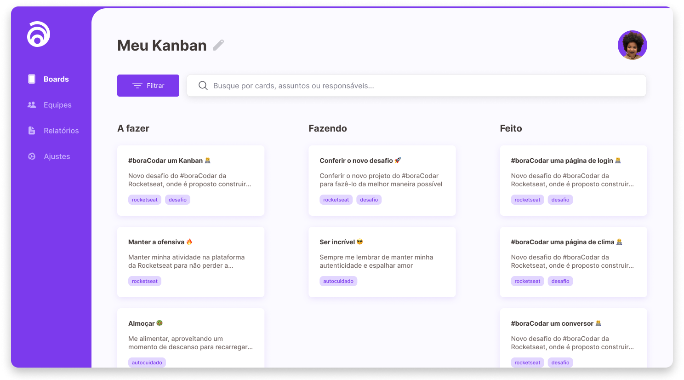

<h1 align="center"> Kanban</h1>

Bora codar um Kanban?

  <a href="#-tecnologias">Tecnologias</a>&nbsp;&nbsp;&nbsp;|&nbsp;&nbsp;&nbsp;
  <a href="#-projeto">Projeto</a>&nbsp;&nbsp;&nbsp;|&nbsp;&nbsp;&nbsp;
  <a href="#-layout">Layout</a>&nbsp;&nbsp;&nbsp;|&nbsp;&nbsp;&nbsp;
  <a href="#memo-licença">Licença</a>

 

  

## 🚀 Tecnologias

Esse projeto foi desenvolvido com as seguintes tecnologias:

- JavaScript/Typescript
- [Node](https://nodejs.org/)
- [ReactJS](https://reactjs.org/)
- [Styled-Components](https://styled-components.com/)
- [Vite](https://vitejs.dev/)
- [Vitest](https://vitest.dev/)
- [Yarn](https://yarnpkg.com/)

## 💻 Projeto

Este projeto trata-se de uma aplicação de Kanban com as seguintes
funcionalidades:

- [x] Lista de tarefas (Cards) por Status (Todo, Doing, Done)
- [x] Busca/Pesquisa de tarefas (Título e Descrição)
- [x] Drag and Drop de tarefas (Cards)
- [x] Atualizar Status de Tarefa (Todo, Doing, Done)
- [x] Adicionar uma nova tarefa (Card)
- [x] Remover uma tarefa (Card)
- [x] Validação de Formulário

Funcionalidades na fila de implementação:

- [ ] Filtro por tags de tarefas (Cards)
- [ ] Editar/Atualizar tarefa (Card)
- [ ] Possibilitar cadastro de usuário
- [ ] Relacionar usuário em tarefas

## :memo: Licença

Esse projeto está sob a licença MIT.

---

Feito com ♥ by [@indiocode](https://instagram.com/indiocode) :wave:
