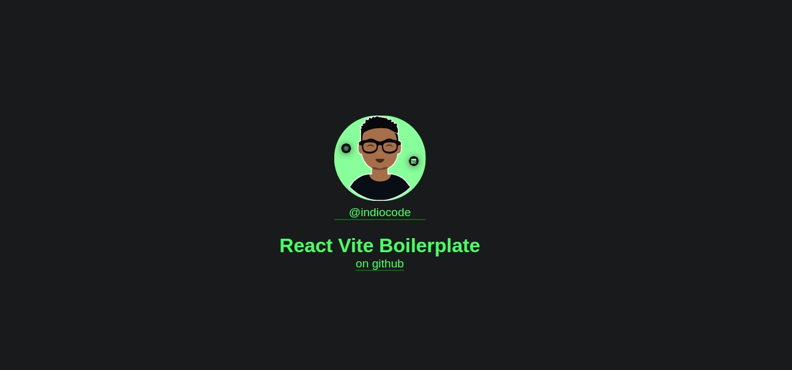

<h1 align="center"> React Vite Boilerplate </h1>

Template base para React Web App

  <a href="#-tecnologias">Tecnologias</a>&nbsp;&nbsp;&nbsp;|&nbsp;&nbsp;&nbsp;
  <a href="#-projeto">Projeto</a>&nbsp;&nbsp;&nbsp;|&nbsp;&nbsp;&nbsp;
  <a href="#-layout">Layout</a>&nbsp;&nbsp;&nbsp;|&nbsp;&nbsp;&nbsp;
  <a href="#memo-licença">Licença</a>

  

 

  

## 🚀 Tecnologias

Esse projeto foi desenvolvido com as seguintes tecnologias:

- JavaScript/Typescript
- [Node](https://nodejs.org/)
- [ReactJS](https://reactjs.org/)
- [Styled-Components](https://styled-components.com/)
- [Vite](https://vitejs.dev/)
- [Vitest](https://vitest.dev/)
- [Yarn](https://yarnpkg.com/)

## 💻 Projeto

React Vite Boilerplate é um template base para aplicações react que possui as
seguintes bibliotecas pré configuradas

- Aliases: categorizar apontamentos de importação para o ./src
- ESlint/Prettier para regras e padronização de escrita de código JSX/TS
  - Auto Import: corrgir automaticamente as importações
  - Organize Import: categorizar e organizar importação
  - Consistent Type Import: explicitar o type/interface na importação
  - Explicit Function Return Type: definir tipo de retorno de função
  - Exhaustive Hooks Deps: identificar itens para o array de dependencias em
    Hooks
  - Resolve Aliases: resolvedores de importação com uso de aliases
- Styled-Components: definir a criação de componentes estilizados
- Vitest: realizar testes com o auxilio e integração de Testing Library e Jest
  Styled Components

## :memo: Licença

Esse projeto está sob a licença MIT.

---

Feito com ♥ by [@indiocode](https://instagram.com/indiocode) :wave:
